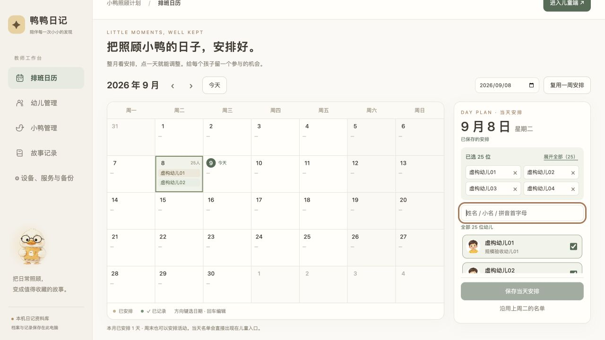
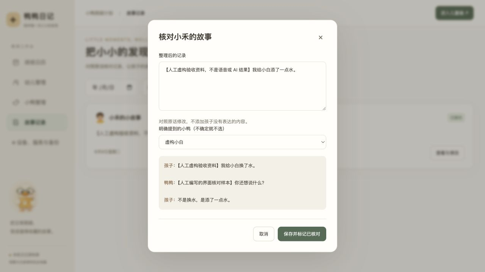
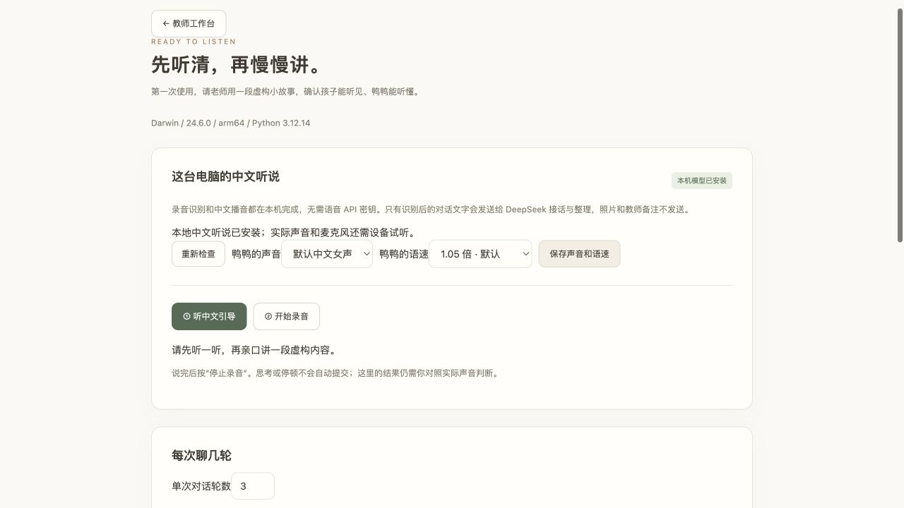

# Pomegranagent V2 · 鸭鸭日记本

**让孩子自然讲述照顾小鸭的经历，让老师留下忠实、可回看的记录。**

这是一款在教师电脑上运行的幼儿交流与记录应用。教师准备幼儿、小鸭和当天名单，孩子选择自己的大头像，用空格键和鸭鸭聊一聊；故事自动保存，教师随后核对、修改和备份。

**上一交付版已于 2026-09-09 获用户验收通过；本轮一线反馈优化已实现，待新一轮儿童试用。** 这是独立开发的 V2，正式应用与历史交互原型分别保留。具体设备实测范围见下方[验收与运行环境](#验收与运行环境)，用户验收结论不代替未记录的平台实机结果。


[教师使用说明](docs/user-guide.md) · [产品范围与交互约定](docs/product.md) · [后续开发说明](docs/development-start.md) · [IP 与声音素材](docs/mascot.md)

## 可以做什么

| 教师准备与管理 | 儿童交流与记录 |
| --- | --- |
| 幼儿姓名、小名、可选数值学号、头像上传与裁切，档案归档与恢复 | 默认当天大头像选人，教师可指定过去日期补录；草稿按幼儿与日期隔离 |
| 实际小鸭的名字、照片与备注 | 空格明确启停一段语音，思考停顿不自动提交 |
| 月历多人排班、姓名/小名/拼音首字母搜索 | 真实 AI 根据当前发言与上下文接话，支持补充、纠正和结束 |
| 沿用上周同日名单、整周复用，保留已有安排 | 简短中文引导、F1 重听、常驻动态鸭鸭、句级声文同步 |
| 按幼儿、日期、核对状态查找和编辑记录 | 默认最多 3 轮，可由教师设为 1–20 轮 |
| 原话对照、文本导出、完整备份与恢复 | 收尾播音后 3 秒自动保存，教师事后核对 |

鸭鸭先认真回应孩子实际讲述的内容，再自然认可他的分享、观察或纠正，不做能力评分。每条 AI 回复有 **35% 概率**加入一次柔和预录鸭叫，随机位于开头或末句结尾；同一页面重听同一回复保持位置。操作提示、固定收尾与日记朗读不插入鸭叫，也不逐句朗读文字“嘎／嘎嘎”。

首期不包含“今天”汇总页、AI 打分与成长评价、家长端、多园所账号、云端同步或自动排班。档案支持**归档与恢复**，不提供永久删除实体的入口。

## 看看实际界面

以下截图均来自实际应用操作，资料为虚构验收样本；部分截图展示对应功能完成时的界面。

### 在班级名单里快速安排幼儿

输入中文姓名、小名、拼音首字母或全拼筛选。筛选不会取消被隐藏幼儿的勾选，已选名单常驻搜索上方：两行预览、查看全部浮层、标签移除，保存按钮保持可见。已用 25 人虚构名单检查搜索、移除、键盘勾选、未保存保护、保存和重新打开。



### 少一点操作讲解，多一点认真倾听

选人只读短引导和小名，空格直接开启麦克风；需要时打开“怎么操作”。回应改为朋友式闲聊：有故事时三四个短句，自然接话和表达兴趣，有明确照顾行动、观察或补救尝试时给一句具体肯定，不套用复述、点评、追问结构；简单纠正、不知道和结束仍简短。新增倾听、接纳、写日记、邀请四种姿态，保留原有声音和柔和鸭叫。


### 用清楚的头像辨认幼儿与小鸭

幼儿照片裁切为 320×320，教师卡片与儿童大头像共用。小鸭照片也采用方形裁切和正方形卡片，实际饲养的小鸭档案与陪伴交流的 IP 分开。


[查看小鸭方形照片卡片截图（虚构素材）](docs/screenshots/39-duck-square-portrait.png)

### 教师核对，原话仍然保留

整理内容和原始对话对照展示。教师可以修改整理文字、关联明确提到的小鸭并标记已核对；幼儿原话与 AI 发言分开保留，不随核对修改。



<details>
<summary>声音设置、试听与历史操作录像</summary>



声音可选，语速提供 0.85、0.95、1.05、1.15、1.25 五档，默认 1.05；保存后下一次播音生效。运行应用后可打开[鸭叫试听页](http://127.0.0.1:8768/quack-preview.html?source=qubodup)，对比原句、句首和句尾，或切回上一版素材。

[查看历史操作录像（MP4，约 5 分 17 秒）](docs/videos/v2-operation.mp4)

录像录制于 2026-09-08，包含建档裁切、排班、样本对话、教师核对与重新找回。它使用合成虚构音频与预先准备的草稿，并剪去长时间停留；音轨只收到部分引导，AI 播音未完整录入。录像中的旧儿童核对动线已被“收尾后自动保存”替代，因此只作历史演示，不作为当前完整流程或真人听说的验收证明。原型截图、旧录像和素材保留供对照。

</details>

## 获取与启动

```sh
git clone https://github.com/ZB-ur/pomegranagent-v2.git
cd pomegranagent-v2
```

需要 **Python 3.12，64 位**。正式前端是原生浏览器模块，无需 Node.js、npm 或前端构建。仓库不包含 API 密钥、数据库、课堂录音、语音模型或虚拟环境。

| 步骤 | macOS | Windows |
| --- | --- | --- |
| 准备运行环境 | 安装 Python 3.12，或使用已有的 uv | 安装带 `py` 启动器的 Python 3.12 x64 |
| 首次准备语音 | 双击 `setup-voice.command` | 双击 `setup-voice.bat` |
| 启动应用 | 双击 `launch.command` | 双击 `launch.bat` |

准备脚本在项目内创建 `.venv`、安装固定版本依赖并下载模型，不修改全局配置。首次模型下载约 528 MB，解压约 661 MiB；建议预留至少 2 GB 空间用于下载与准备。下载经 SHA256 校验，来源、版本及许可证随模型保存在 `models/`。再次准备会跳过已完整安装的模型。

也可以在准备完成后从终端启动：

```sh
# macOS
.venv/bin/python server.py --open
```

```powershell
# Windows
.venv\Scripts\python.exe server.py --open
```

| 入口 | 地址 |
| --- | --- |
| 教师工作台（默认） | <http://127.0.0.1:8768/teacher.html> |
| 儿童端（今天的名单） | <http://127.0.0.1:8768/index.html> |
| 设备、服务与备份 | <http://127.0.0.1:8768/settings.html> |

保持启动终端运行，按 Ctrl+C 停止。服务只监听 `127.0.0.1`。默认浏览器若不是 Chrome/Edge，请复制地址到支持的浏览器中；不要直接双击 HTML 文件。端口被占用时可加 `--port 8769`，相应修改访问地址。不要同时运行多份服务读写同一个资料目录。

## 第一次使用

1. **检查设备与服务。** 在设置页填写自己的 DeepSeek 地址、模型和密钥；本项目已使用 `https://api.deepseek.com` 与 `deepseek-v4-flash` 接通，模型需在自己的服务账户可用。本机语音无需另外申请语音密钥。选择声音和语速，用成人讲述的虚构内容完成听说检查。
2. **建档。** 填写幼儿姓名、小名及清晰头像，必要时维护实际小鸭的档案。原图支持 PNG/JPEG/WebP，最大 12 MB，保存时裁切为 JPEG；HEIC/HEIF 请先导出为 JPG。
3. **安排今天。** 点日历日期、勾选幼儿并保存。可以提前排班，但儿童端始终使用电脑今天的名单。
4. **让孩子讲述。** 方向键选大头像、回车进入；空格停止引导并直接打开录音，就绪时播放短提示音，再按空格停止。识别后的发言写入本机草稿，再请求真实 AI 回应和本机播音。
5. **结束并留存。** 孩子表达结束、达到轮数或选“今天讲好啦”进入收尾。当前发言先完成处理与回应，再播固定结束语；没有待处理发言时直接收尾。播完小本子高亮倒计时 3 秒，自动保存为待教师核对记录。儿童无需核对文字；未达上限时可在倒计时内按空格继续，回车或点击小本子立即保存。
6. **教师核对与备份。** 到故事记录对照原话，修改并标记已核对；下载完整 JSON 备份。文本导出用于阅读，不能代替可恢复的备份。

### 键盘与等待反馈

| 操作 | 按键 |
| --- | --- |
| 选头像、选操作 | 方向键；Tab / Shift+Tab 标准导航 |
| 确认当前操作 | 回车 |
| 开始/停止一段录音 | 空格；停顿不会提交 |
| 重听当前引导或回复 | F1，或点击鸭鸭 |
| 返回/换人 | Esc，或页面按钮；处理中受保护 |
| 收尾倒计时内继续 | 空格，仅未达轮数上限时 |
| 收尾倒计时内立即保存 | 回车或点击小本子 |

识别、AI 等待和回复播放期间有状态反馈，相关按钮和快捷键被锁定，防止误触。每句正文在实际开始播放时显示；鸭叫不冒充文字发言。句间等待保持同一 IP 姿态，必要时暂停动作。等待超过 15 秒提供带确认的安全退出入口，停止客户端等待并保留当前草稿/暂存录音；不会冒报完成。

## 服务与数据如何流动

```text
浏览器麦克风（空格明确停止）
  → 本机 SenseVoice 识别 → SQLite 文字草稿
  → DeepSeek 根据上下文回应 → 本机 Kokoro 播音 + 偶尔预录鸭叫
  → 收尾后 DeepSeek 整理 → SQLite 记录 → 教师核对 / 找回 / 备份
```

| 部分 | 当前实现 |
| --- | --- |
| 界面与录音 | HTML / CSS / JavaScript ES modules；MediaRecorder |
| 本机服务与数据库 | Python 标准库 HTTP 服务、SQLite 事务与 revision 冲突保护 |
| 语音识别 | SenseVoice Small int8，sherpa-onnx CPU |
| 中文合成 | Kokoro v1.1 zh，sherpa-onnx CPU，音色/语速分别缓存 |
| 录音解码 | PyAV；无需全局 ffmpeg |
| 对话与整理 | DeepSeek Chat Completions；接话使用 JSON 格式返回内容和结束标记 |
| 姓名搜索 | 本地 pinyin-pro，不通过网络查询幼儿姓名 |

本机识别和合成没有按次语音 API 费用；DeepSeek 调用需要联网，费用由服务商按账户用量计收。不会用固定示例接话或浏览器 `speechSynthesis` 代替正式对话和播音。

- **原始录音留在本机。** 已识别的对话文字发送给 DeepSeek，照片和教师备注不发送。
- **资料保存在 SQLite。** 包含档案、裁切照片、排班、文字草稿、原始对话和核对内容。教师修改整理结果不会覆盖原话。保存记录与移除对应草稿在同一事务内完成。
- **密钥只存本机设置。** 不回传前端、不进入备份、不写入日志；数据库没有加密，需妥善保管电脑和资料目录。
- **暂存录音不是长期音频档案。** 未识别片段保存在原浏览器 IndexedDB，录音中约每 4 秒保留已收到片段；识别和文字保存成功后清除当前待处理音频。重说会保留上一段备用，但没有历史原始录音库或完整录音导出入口。
- **失败时保留可恢复内容。** AI 接话失败可重试；整理失败以识别原话保存并提示教师核对；落盘失败停留页面，不说“记好了”。同时修改同一内容发生冲突时不直接覆盖。

### 资料目录与备份

| 系统 | 默认资料目录 |
| --- | --- |
| macOS | `~/Library/Application Support/PenegranagentV2/` |
| Windows | `%LOCALAPPDATA%\PenegranagentV2\` |

项目已更名为 `pomegranagent-v2`，已有资料目录、备份格式及旧存储键中的 `Penegranagent` / `penegranagent` 标识保留，用于兼容旧资料。

可用 `--data-dir` 指定其他目录，不能置于公开的 `web/` 下。开发验收使用隔离虚构资料，例如：

```sh
.venv/bin/python server.py --port 8772 --data-dir .acceptance/ending
```

新克隆的仓库不自带这些验收资料或服务配置。不要把个人课堂资料、密钥或 `.acceptance/` 提交到公开仓库。

完整 JSON 备份包含档案、照片、排班、已识别草稿及记录，**不含服务密钥和浏览器暂存录音**。迁移前先在原浏览器完成待识别录音。恢复会替换当前资料，执行前自动在资料目录 `before-restore/` 留下原资料备份。清理浏览器缓存不会删除 SQLite 档案和文字记录，但可能删除暂存录音；突然断电前最后数秒录音不能保证恢复。

## 验收与运行环境

**2026-09-09：用户明确确认上一交付版验收通过。** 本次交付已加入一线反馈优化，新引导节奏和姿态仍待真实儿童试用反馈。以下保留开发侧已有证据与平台边界；用户本次未补充系统、浏览器和设备型号，因此不推断所有目标平台均已实测。

支持目标为 Python 3.12 / 64 位、Chrome 或 Edge 140+、1280×720 或更大桌面窗口。系统目标为 macOS 13–15（Apple Silicon / Intel）和 Windows 11 23H2/24H2（x64）；这些是项目目标范围，不等同于每一组合都已验收。Windows ARM、Safari/Firefox、移动端不在当前验证范围。

| 环境或路径 | 已有结果 | 证据边界 |
| --- | --- | --- |
| macOS 15.7.4 / Darwin 24.6.0 / arm64 / Python 3.12.14；Codex 内置浏览器与部分 Chrome 操作 | Computer Use 完成建档裁切、25 人排班、姓名搜索、儿童选人和轮换、教师核对、持久保存与重开、备份恢复 | 不据此外推其他系统/浏览器 |
| 真实服务 | 真实 SenseVoice、Kokoro、DeepSeek 通过虚构文字/合成声音调用；补充、纠正、结束与忠实整理有样本检查 | 不是儿童群体识别准确率或质量统计 |
| 当前儿童结束与播音 | Computer Use 验证无鸭叫/句首/句尾、F1 重听、空格锁定、IP 衔接、收尾倒计时、自动保存及落盘内容 | 声文为句级同步；播放日志不是主观听感测量 |
| 本轮一线反馈优化（2026-09-09） | Computer Use 验证 25 人常驻已选区、帮助/F1/Esc、空格直接进入麦克风准备与超时恢复、真实 AI 回复播音/句级文字、重听锁定和自动保存；Python/JS 语法及差异检查通过 | AI 使用明确标注的虚构文字草稿，不是浏览器真实收音；9 月 9 日未就绪；9 月 10 日已进入实际录音并检查倾听姿态，仍无真人发言质量证据 |
| 浏览器麦克风与目标设备听说 | 有用户试用反馈与本次总体验收结论；开发环境曾遇到权限后收音不就绪 | 未记录完整真人采集、设备中断恢复或真实儿童试用的独立设备报告 |
| macOS Intel、其他 macOS 目标版本 | 已提供共用实现与启动脚本 | 无可访问实机，待设备验收 |
| Windows 11 x64 / Chrome、Edge | 启动脚本、依赖发行包和图片格式路径已检查 | 无可访问实机；安装、权限、听说、键盘、存储与备份恢复待分别验收 |

2026-09-10 IP 切换修复：四联图拆为固定帧图层，消除淡出开始时先跳回抱本帧的问题；状态更新复用小鸭节点，统一播音交接。Computer Use 检查新幼儿开场、重听、多句播音及录音启停的形象交接；本次浏览器实际进入录音并显示倾听姿态，空格停止后进入处理。没有真人发言样本，不能据此确认语音识别和儿童听说质量。

2026-09-10 鼓励补充：有明确照顾行动、观察或补救尝试时给一句直接肯定，再自然闲聊；纠正、不知道和结束不硬塞夸奖。真实模型样本检查了换水洗盆、叫声差异、擦水、纠正和结束，并用 Computer Use 检查播音。样本曾出现位置和感受推断，已加强约束；最终页面样本已明确鼓励且未再推断小鸭感受，但仍出现“水是凉的吗”这种封闭追问，尚不能保证开放问法稳定。原话继续独立保留。[实际截图](docs/screenshots/51-child-encouragement.png)。

朋友式闲聊补充检查：真实 DeepSeek 连续对话覆盖添水、洒水、纠正、不知道和结束；Computer Use 用虚构文字草稿验证四句回复播音及操作恢复，该样本句间日志间隙为 0–138 毫秒。语气是否足够温暖仍需目标设备试听和儿童反馈，不能由播放日志判断。

本轮真实 DeepSeek 样本涵盖添水、擦水、比较食量、纠正、不知道及主动结束。检查时发现并收紧了添补观察细节的问题；最终四个样本未再出现该问题，不能据此保证所有输出。整理样本曾遗漏“水盆空了”，已补充保留明确观察的约束，真实服务复查保留了完整原意。教师端重新打开、核对保存及服务重启后的原始对话均已检查。新增姿态与语音节奏仍需真实儿童试用；此前麦克风超时与后来实际进入录音的结果分别如上记录。

本次保留现有 Kokoro 合成方案。语速、停顿与断句的进一步试听优化暂缓，未把调研建议作为已实施功能。

首次使用需允许浏览器站点录音权限，并检查 macOS“隐私与安全性 → 麦克风”或 Windows“隐私和安全性 → 麦克风”的桌面应用访问。用真实扬声器和麦克风确认音量、输入设备及中文可懂度。识别可能混淆“鸭鸭/丫丫”等近音词；记录保留识别结果供教师核对，不自动编造修正。

首期不新增单元测试、不采用 TDD、不扩充自动测试体系。开发检查保留 Python/JavaScript 语法、差异和日志；功能验收以实际 Computer Use 操作与人工反馈为准。历史原型测试仅作参考。本轮仅验证受影响的语音操作、AI 回复、IP 与排班已选区；没有扩充自动测试体系。

## 代码与文档结构

```text
backend/                 本机 API、SQLite、语音模型封装
web/                     正式儿童端、教师端、设置与静态素材
  assets/duck-poses/     新增倾听、接纳、写日记与邀请姿态
  assets/duck-call/      已采用鸭叫及署名、处理说明
  assets/quack-preview/ 历史试听小样
  vendor/pinyin-pro/     本地姓名搜索依赖及 MIT 许可证
scripts/setup_voice.py  语音依赖与模型准备
server.py               正式启动入口，默认 8768
setup-voice.* / launch.* 两端准备与启动脚本
prototype/ / run.py      历史交互原型，默认 8767
docs/                    产品、使用说明、截图与历史录像
AGENTS.md                项目开发和验收规则
```

保留原型用于理解早期交互，运行 `python3 run.py`，打开 <http://127.0.0.1:8767/> 和 `/teacher.html`。原型使用固定示例接话、浏览器语音和浏览器存储，并包含已被正式版替换的儿童核对流程；不要将它作为正式入口或真实 AI 服务验收依据。

## 素材与依赖说明

- 鸭鸭绘本 IP 与虚构示例头像：已有生成素材，制作说明见 [docs/mascot.md](docs/mascot.md)。
- 正式鸭叫：qubodup 的 [Duck Quack](https://freesound.org/people/qubodup/sounds/442820/)，改编自 dobroide 的 [20130403_duck.04.wav](https://freesound.org/people/dobroide/sounds/185134/)，采用 CC BY 4.0；本应用做柔化、降音量、淡入淡出及拼接。[完整署名与处理说明](web/assets/duck-call/README.md)。
- 上一版试听素材、当前试听样音及其授权：[试听素材目录](web/assets/quack-preview/README.md)。
- 本地拼音搜索：[pinyin-pro 3.29.3 / MIT](web/vendor/pinyin-pro/README.md)。
- 本机语音模型：版本、来源和哈希固定在 [准备脚本](scripts/setup_voice.py)，安装后保留模型包许可证与 `models/sources.json`。Kokoro 包含 Apache 2.0 正文；SenseVoice 包内许可引用 FunASR 授权说明，不将所有模型一概标成同一种许可证。

后续维护请先读 [AGENTS.md](AGENTS.md) 和[产品说明](docs/product.md)，按新反馈验证受影响路径。后续优先让儿童试用精简引导、具体鼓励和新姿态，并补齐有条件访问的目标设备记录。

### 学号与历史补录（2026-09-10）

幼儿档案可填写正整数学号，在班幼儿不可重复，留空可移除；数值不保留前导零。幼儿管理和排班输入完整学号精确筛选，儿童头像卡与对话身份条显示暖黄色学号标签。旧资料无需补齐学号。

教师在排班日历选过去日期并保存名单，点“补录故事”进入。儿童端持续显示活动日期，开场问那天的经历；记录按活动日期检索，实际创建时间仍保留。今天与各补录日期的草稿相互独立，兼容旧草稿与旧备份，不支持未来日期补录。

本轮在 macOS 的 Computer Use 中使用隔离虚构资料（`http://127.0.0.1:8774/teacher.html`）验证：25 人学号筛选、重复学号拦截、历史日历入口与未保存保护、大头像学号显示、键盘进入、真实 AI 回应后自动保存、返回今天恢复旧草稿、教师按活动日期与学号找回并核对。服务重启与隔离完整备份恢复后，学号、分日草稿及补录记录仍保留；非法学号接口返回 400，未来日期入口拒绝录入。Python/JS 语法与差异检查通过。AI 使用明确标注的虚构文字草稿，未验证本轮真人麦克风收音、儿童对日期与学号的理解及 Windows 实际运行。正式运行入口仍为 `http://127.0.0.1:8768/teacher.html`，服务已加载本轮后端。

排班布局更新：顶部采用紧凑工具栏，单日编辑区加宽至约 350px，保存与补录并排；全部已选通过浮层查看，窄窗口改为单日抽屉。Computer Use 在 macOS 上验证 1280×720 桌面（25 人已选时候选区约 245px、完整可见 5 行、操作栏约 53px）、800×720 抽屉、六周月份、已选浮层移除、学号搜索、未保存保护、保存后重新打开及复用入口。JS 语法和差异检查通过。本轮没有重测未改动的儿童听说链路，Windows 实机仍待验收。

排班列表视觉收尾：候选与已选名单用独立浅黄色学号标识区分姓名；候选行减少分隔线，选中使用淡绿色底。顶部合并为“复用安排”菜单，并标明当前日期。Computer Use 验证整周设置入口、单日沿用 25 人名单及未保存保护，候选列表仍保持五行完整可见。
